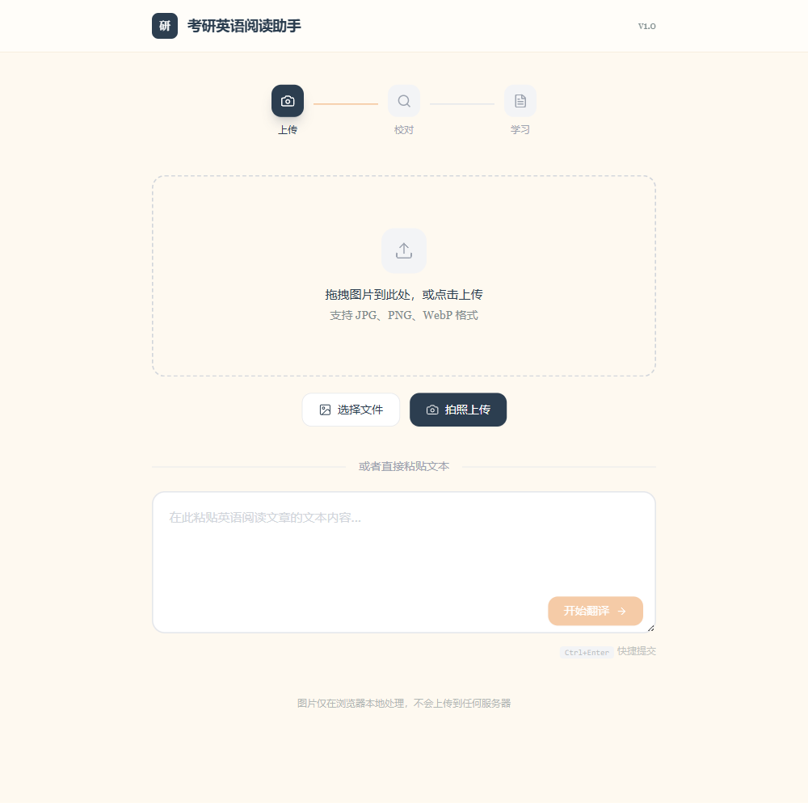

<div align="center">
  <h1>📖 考研英语阅读助手</h1>
  <p><strong>OCR 识别 → 逐句翻译 → 词典标注，一站搞定考研英语阅读</strong></p>
  <p>
    
    
    
    
    
  </p>
  <p>
    <a href="https://6huang6.github.io/kaoyan-reader">🌐 在线体验</a>
  </p>
</div>

---

## 🎯 这是什么

做考研英语阅读时，你可能是这样的：

- ✋ 做真题阅读，生词太多，查词典打断思路
- ✋ 对完答案想精读，逐句翻译要复制粘贴好多次
- ✋ 想重点背考研大纲词汇，但不知道哪些是

**考研英语阅读助手** 解决这些问题：

1. 📸 **拍照/截图上传** → OCR 自动识别文字
2. 🌐 **自动翻译** → 逐句对照，保留原文排版
3. 📝 **考研词汇高亮** → 大纲词自动标注，点击查词典

> 🎬 **演示视频：** (待上传 — 可放在 GitHub Release 或 B站)

## ✨ 功能

| 功能 | 说明 |
|------|------|
| 📸 OCR 识别 | 支持图片上传、拍照，自动提取英文文字 |
| 🌐 逐句翻译 | 自动分段，逐句翻译，中英对照显示 |
| 📝 考研词汇标注 | 大纲词自动下划线高亮，一目了然 |
| 📖 点击查词 | 点击单词弹出详细释义，大纲词优先显示本地释义 |
| ✂️ 直接粘贴 | 已有电子版文本可直接粘贴翻译 |
| 📱 PWA 支持 | 可安装到手机/桌面，离线缓存 |
| 🔒 隐私安全 | 图片仅在浏览器本地处理，不上传服务器 |

## 🖼️ 截图



## 🛠️ 技术栈

| 层 | 技术 |
|------|------|
| 框架 | React 18 + TypeScript |
| 构建 | Vite 6 |
| 样式 | Tailwind CSS 3 |
| 图标 | Lucide React |
| 翻译 | Supabase Edge Function → Google Translate |
| OCR | OCR.space API |
| 部署 | GitHub Pages (纯静态) |
| PWA | Service Worker + Web Manifest |

## 🚀 快速开始

```bash
# 克隆
git clone https://github.com/6huang6/kaoyan-reader.git
cd kaoyan-reader

# 安装依赖
npm install

# 启动开发服务器
npm run dev

# 构建生产版本
npm run build

# 预览构建结果
npm run preview
```

## 📁 项目结构

```
kaoyan-reader/
├── public/
│   ├── manifest.json       # PWA 配置
│   ├── sw.js               # Service Worker
│   └── vocab.json          # 考研词汇表（多释义格式）
├── src/
│   ├── components/         # UI 组件
│   │   └── OriginalText.tsx
│   ├── pages/
│   │   ├── HomePage.tsx    # 首页：上传/粘贴
│   │   ├── LoadingPage.tsx # 翻译进度
│   │   └── ResultPage.tsx  # 结果：对照阅读 + 查词
│   ├── services/
│   │   ├── ocr.ts          # OCR 识别
│   │   ├── translate.ts    # 翻译 + 词典查询
│   │   └── vocab.ts        # 考研词汇标注
│   ├── types/
│   │   └── index.ts        # 类型定义
│   ├── hooks/
│   ├── App.tsx
│   ├── main.tsx            # 入口 + SW 注册
│   └── index.css           # Tailwind + 全局样式
├── supabase/
│   └── functions/translate/ # Supabase Edge Function（翻译代理）
├── deno-proxy/             # Deno 代理（备用）
├── screenshots/            # 截图
├── index.html
├── vite.config.ts
├── tailwind.config.js
└── package.json
```

## 🏗️ 架构说明

**纯前端应用**，不依赖后端服务器。OCR 和翻译通过第三方 API 实现：

1. **OCR 识别**：图片压缩后发送到 OCR.space API，返回识别文本
2. **翻译**：通过 Supabase Edge Function 代理 Google Translate（解决国内直接访问 Google 的限制）
3. **词典**：优先使用本地考研词表释义，查不到的通过翻译接口获取
4. **词汇标注**：对所有单词做 lemma 还原（处理时态/复数/派生），匹配考研大纲词表

## 🌐 部署

项目是纯静态站点，可部署到任意静态托管服务：

### GitHub Pages

1. Fork 项目
2. 在 GitHub repo Settings → Pages 中启用
3. 设置分支为 `gh-pages` 或使用 Actions 自动部署
4. 修改 `vite.config.ts` 中的 `base` 为你的路径

### Vercel / Netlify

直接导入项目即可，框架自动识别为 Vite。

## 📄 License

MIT
